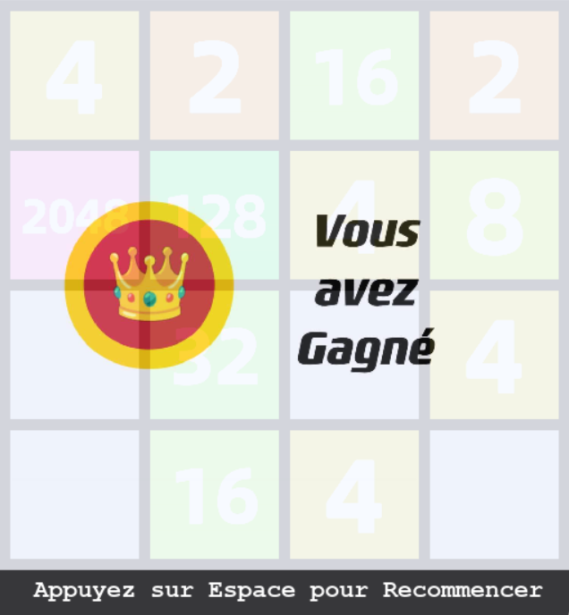

2048Bae
=======

2048Bae est une version modifiée du jeu de puzzle populaire "2048", réalisé en Python. Le but du jeu est de combiner des tuiles numérotées pour atteindre un score cible spécifique. Le jeu propose deux modes à choix : 4x4 et 5x5.

`bibliothèque obligatoire : pygame`
## Comment jouer

Le jeu 2048Bae se joue sur un tableau de 4x4 ou 5x5 cases. Au début du jeu, une tuile de valeur 2 ou 4 est placée au hasard sur le tableau. Les joueurs doivent faire glisser les tuiles vers le haut, le bas, la gauche ou la droite pour combiner des tuiles de même valeur et atteindre le score cible.

Dans le mode 4x4, le score cible est de 2048. Les joueurs doivent continuer à combiner les tuiles pour atteindre une tuile de valeur 2048, en utilisant des stratégies de réflexion et de planification pour maximiser leurs scores.

Dans le mode 5x5, le score cible est de 8192. Les joueurs doivent continuer à combiner les tuiles pour atteindre une tuile de valeur 8192, en utilisant des stratégies de réflexion et de planification pour maximiser leurs scores.

Le jeu se termine lorsque le joueur atteint le score cible dans le mode choisi, ou lorsque le tableau est rempli de tuiles et qu'aucun mouvement supplémentaire n'est possible.

## Règles du jeu 2048Bae

- Le joueur peut faire glisser les tuiles vers le haut, le bas, la gauche ou la droite pour les déplacer sur le tableau.
- Les tuiles ne peuvent être combinées que si elles ont la même valeur.
- Lorsque deux tuiles de même valeur sont combinées, elles sont remplacées par une tuile de valeur double.
- Les joueurs doivent continuer à combiner les tuiles jusqu'à atteindre le score cible.
- Le jeu se termine lorsque le joueur atteint le score cible dans le mode choisi, ou lorsque le tableau est rempli de tuiles et qu'aucun mouvement supplémentaire n'est possible.

Pour protéger les ordinateurs qui ne sont pas assez puissants, on a mis sleep(0.1) pour limiter la vitesse de joueur, vous pouvez l'enlever ou remplacer avec sleep(0.01) pour être plus rapide.

## Contribuer

Nous encourageons les autres développeurs à contribuer à notre jeu pour l'améliorer et l'enrichir. Si vous souhaitez contribuer, veuillez suivre les étapes suivantes :

- Forkez ce projet et clonez-le sur votre ordinateur.
- Créez une nouvelle branche pour vos modifications : git checkout -b ma-nouvelle-fonctionnalité
- Effectuez vos modifications et testez-les soigneusement.
- Soumettez une demande de tirage (Pull Request) avec vos modifications.
- Attendez que votre demande de tirage soit examinée et intégrée au projet.

Si vous rencontrez des problèmes ou des bugs avec le jeu, veuillez les signaler en ouvrant une issue dans ce dépôt. Nous apprécions toute contribution à notre projet et nous vous remercions de votre aide pour le rendre meilleur.

## Licence

Ce projet est sous licence MIT, mais veuillez noter que cette licence s'applique uniquement aux fichiers de code (par exemple les fichiers .py) et non aux autres éléments tels que des images ou des sons qui pourraient être inclus dans ce projet.

Vous n'êtes pas autorisé à utiliser, modifier ou distribuer tout autre élément que les fichiers de code sans la permission explicite du propriétaire de ces éléments.

Pour plus d'informations, veuillez consulter le fichier [LICENSE](LICENSE.txt) pour connaître les détails des fichiers de code couverts par la licence MIT.
